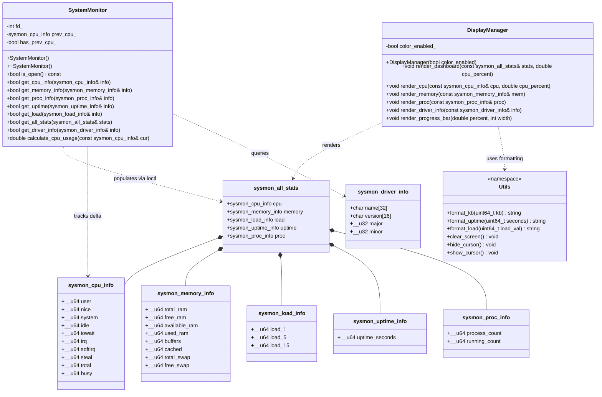

# SysMon — UML Class Diagram

This diagram models the object-oriented structure of the user-space C++ application and its relationship to the shared kernel C data structures.

```mermaid
classDiagram
    direction TB

    class SystemMonitor {
        -int fd_
        -sysmon_cpu_info prev_cpu_
        -bool has_prev_cpu_
        +SystemMonitor()
        +~SystemMonitor()
        +bool is_open() const
        +bool get_cpu_info(sysmon_cpu_info& info)
        +bool get_memory_info(sysmon_memory_info& info)
        +bool get_proc_info(sysmon_proc_info& info)
        +bool get_uptime(sysmon_uptime_info& info)
        +bool get_load(sysmon_load_info& info)
        +bool get_all_stats(sysmon_all_stats& stats)
        +bool get_driver_info(sysmon_driver_info& info)
        +double calculate_cpu_usage(const sysmon_cpu_info& cur)
    }

    class DisplayManager {
        -bool color_enabled_
        +DisplayManager(bool color_enabled)
        +void render_dashboard(const sysmon_all_stats& stats, double cpu_percent)
        +void render_cpu(const sysmon_cpu_info& cpu, double cpu_percent)
        +void render_memory(const sysmon_memory_info& mem)
        +void render_proc(const sysmon_proc_info& proc)
        +void render_driver_info(const sysmon_driver_info& info)
        +void render_progress_bar(double percent, int width)
    }

    class Utils {
        <<namespace>>
        +format_kb(uint64_t kb) string
        +format_uptime(uint64_t seconds) string
        +format_load(uint64_t load_val) string
        +clear_screen() void
        +hide_cursor() void
        +show_cursor() void
    }

    class sysmon_cpu_info {
        +__u64 user
        +__u64 nice
        +__u64 system
        +__u64 idle
        +__u64 iowait
        +__u64 irq
        +__u64 softirq
        +__u64 steal
        +__u64 total
        +__u64 busy
    }

    class sysmon_memory_info {
        +__u64 total_ram
        +__u64 free_ram
        +__u64 available_ram
        +__u64 used_ram
        +__u64 buffers
        +__u64 cached
        +__u64 total_swap
        +__u64 free_swap
    }

    class sysmon_load_info {
        +__u64 load_1
        +__u64 load_5
        +__u64 load_15
    }

    class sysmon_uptime_info {
        +__u64 uptime_seconds
    }

    class sysmon_proc_info {
        +__u64 process_count
        +__u64 running_count
    }

    class sysmon_driver_info {
        +char name[32]
        +char version[16]
        +__u32 major
        +__u32 minor
    }

    class sysmon_all_stats {
        +sysmon_cpu_info cpu
        +sysmon_memory_info memory
        +sysmon_load_info load
        +sysmon_uptime_info uptime
        +sysmon_proc_info proc
    }

    SystemMonitor ..> sysmon_all_stats : populates via ioctl
    SystemMonitor ..> sysmon_cpu_info : tracks delta
    SystemMonitor ..> sysmon_driver_info : queries
    DisplayManager ..> sysmon_all_stats : renders
    DisplayManager ..> Utils : uses formatting
    sysmon_all_stats *-- sysmon_cpu_info
    sysmon_all_stats *-- sysmon_memory_info
    sysmon_all_stats *-- sysmon_load_info
    sysmon_all_stats *-- sysmon_uptime_info
    sysmon_all_stats *-- sysmon_proc_info
```
